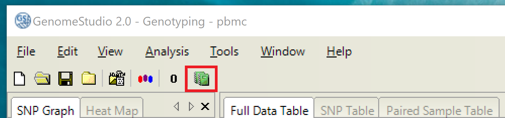

# Genotype processing with GenomeStudio (v2.0.5)

## Step 0: Required software tools

This procedure uses the following software tools:

### Windows (on PC)

1. [MobaXterm](https://mobaxterm.mobatek.net/) - terminal allowing SSH into gatsby/sherlock/etc., also makes it pretty easy to download/upload files
1. [7zip](https://www.7-zip.org/) - creates compressed file archives (like tarballs) that can be read by both windows and linux
1. [GenomeStudio v2.0.5](https://www.illumina.com/techniques/microarrays/array-data-analysis-experimental-design/genomestudio.html)

### Linux (on server)

1. 7zip
    - Ubuntu: `sudo apt install p7zip-full p7zip-rar`
    - CentOS: `sudo yum install p7zip p7zip-plugins`

## Step 1: Compress and download genotyping data

It is easier to download a single compressed file archive than a collection of
uncompressed files, so we'll first compress our genotyping data on the server
using 7zip. The format for the command is:

```
7z a <destination_archive.7z> <input_directory/>
```

`7z a` is short for `7zip archive`. For example:

```
7z a /nfs/lab/aaylward/pbmc_snATAC/210729.7z /nfs/lab/projects/pbmc_snATAC/data/SNParray/210729
```

On the PC, we can then navigate to the `.7z` file and download it using the
graphical interface:

---


---

Finally, we decompress the archive using 7zip:

---


---

## Step 2: Download array-specific product files

Each illumina genotyping array has a corresponding set of product files that
are required for processing the data.

First we'll check which array was used by looking at the sample sheet included
with the data, in this case `210729_Gaulton_Samplesheet.csv`. It indicates that
the array used is [Infinium Omni 2.5-8 v1.5](https://support.illumina.com/array/array_kits/humanomni2_5-8_beadchip_kit/downloads.html). For a different arrayyou'll have
to find its files on support.illumina.com.

We'll need to download the manifest file (either BMP or CSV format) and the
cluster file.

---


---

## Step 3: Process data with GenomeStudio

Once all the data and product files are collected, we can process the
genotyping data. Open GenomeStudio and launch a new genotyping project.

---


---

This will launch the genotyping project wizard. We will need to:

1. Provide a name and location for the project
1. Select "Use sample sheet to load sample intensities"
1. Provide the locations of the sample sheet, the data directory, and the manifest file
1. Select "Import cluster positions from a cluster file" and provide the location of the cluster file. Also select "Calculate Sample and SNP Statistics."
1. Click "Finish" to complete the setup

GenomeStudio will then analyze the data, which might take a while. We will then
see the results of the analysis. There is a lot of information, but only a
couple more steps to export the results.

First, export the sample statistics table, which includes call rates etc.

---


---

Then start the Report Wizard to generate the PLINK input report.

---



---

1. Select "Custom Report" and use the PLINK Input Report plugin. Leave the
parameters at ther defaults
1. Use the default settings for formatting the report
1. Provide a name and ouptut location for the report
1. Click "Finish" to generate the report

## Step 4: Upload and extract PLINK input data

